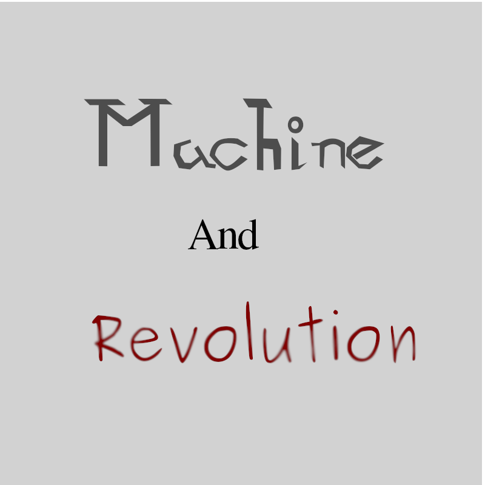

# Machine-And-Revolution
***

## About

In the distopia year of 3000, after the Revolutionary Great War, you play as one of the surivous of the great war,
the world is almost uninhabited and there's the impression that a new war is comming near and near, what you gonna do in a word full of dangers like destroyers, mecha monsters and the greed and corruption of politics to finnaly live a long life or die no mercy.

## Races
Humans:
  the primordial creature, the ones who have created the other races of this roleplay, the ones who have began with everything and might end with everything;

Cyborgs:
  Half Humans and Half machines, but they do not belong in neither of this worlds, they feel uncofortable in living with everyone, because of the preconception of everyone;

UraniumBorn:
  Creatures that have suffered from mutations of radiation and now they need uranium to survive, is this the evolution of the species in this chaotic destroyed world;

War Maker:
  Robots that live to Battle, they, normally, are find in the robotic city of valhalla where battles are an habit and the rule of the stronger wins, the world is for the stringest;

Peace Maker:
  Robots create for the war, but, because of their perception ans intelligence, the war became meaningless, they are strong, but sensive, they are tatical, but with good intensions, are they more human than a human?

Fire Psycho:
  psychic persons with the madness in their right hand and destruction in their left hand, they are the opposite of sanity, created by mad scientist for the war, they now don't belong to nowhere;

Telepatic Psycho:
  another racr created for cold hearted scientists, they can move everything with their mind, but sometimes they lose control and destroy everything around;

Read Psycho:
  The most sane behind the psychos, they read the mind of everyone without control, and, because of that they are condemned by all the other races, besides the Peace Makers. Why does someone want to create some fredomless creatures like them?

Thunder Psycho:
  Mad and cold as ice, their assasination intents are faster as the lighting strikes, some of them can be well intended, but at the end, they are killers.

Doppelganger:
  ?????????????????????????????????????????????????????????????????????????????????????????????????????????????????????????????????????????????????????????????????????????????????????????????????????????????;

Androids:
  They seem like humans, but they do not have heart, this creatures was primordially created as disguised guns to spy and annihilate their enenmies

## Classes

Heavy Arm:
  A class the uses heavy machines like cannons, fuzzils, machine gun and other, they are powerfull, but slowerest soldiers that could exist;

Mercenary:
  in a destructed world where the powerfull ones governates all, money is all, so why do I must play fair and square?! To the hell with this hypocrisy;

Doctor:
  The healers of this world, some of them are good and just want to minimize the suffering, but the others just want to obtein more and more power, this is a neutral class for neutral people;

Scientist:
  Besides the horros that the science created, some good people studied this millenar art to recreate the world to finnaly achive the global world peace;

Mad Scientist:
  the oppostite of good, they have done the most horible things in the war, they are smart and cruel as the devil itself, some people just want to burn the world until ashes;

Honorable Soldier:
  Gold hearted soldiers that fight for what the belive is justice, heroes of a new generation is what they belive they are and their benevolent acts proved it along the years;

Renegade:
  Betrayed and lived to die, they only have rage and revenge in ther acts, you must not provocate this betrayed ex soldiers, if you want to still live and with your sanity, they know every torture technique;

## I want to play... What sould I do?

I see you are a man of culture as well, to play the game, you must invite the bot to your server through the link:

to begin with: >createrule
link of the shop: https://top.gg/bot/753048330098966620